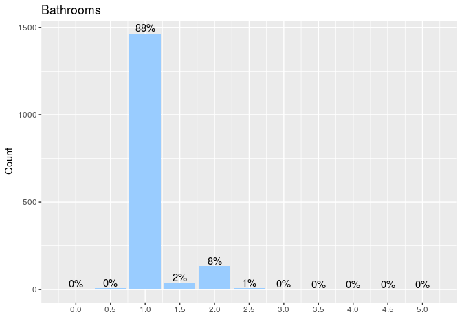
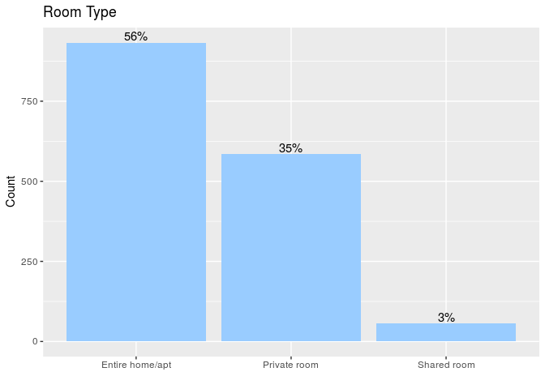
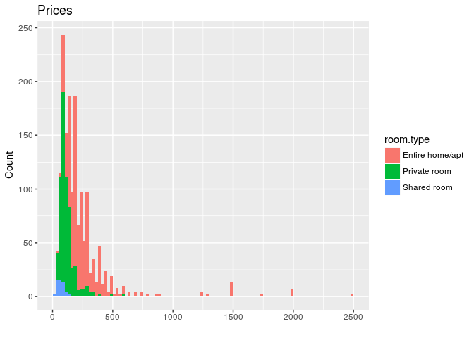
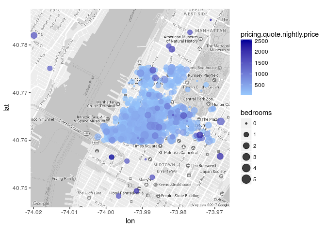

Rbnb
================
Alexander Kroeger, Noah Zinsmeister
2017-04-02

-   [Introduction](#introduction)
-   [Installation](#installation)
-   [Searching by Location](#searching-by-location)
    -   [Metadata](#metadata)
    -   [Results](#results)
-   [Listing Details](#listing-details)
-   [Price Prediction](#price-prediction)

Introduction
------------

Rbnb is an experimental front end for the (unofficial) Airbnb API. In addition to pulling detailed data on Airbnb listings based on arbitrary user-defined locations, Rbnb also provides a variety of visual summaries of these listings.

Use cases include, but are not limited to:

-   Prospective Airbnb guests and hosts who want to get a sense of the Airbnb market in their target location.
-   Current Airbnb hosts who wish to see how the price of their existing listing compares to similiar listings in their area.
-   Researchers interesting in analyzing granual microdata on short-term rental markets.

The authors are grateful to [The Official Unofficial Airbnb API Docs](http://airbnbapi.org/) for documenting much of the Airbnb API.

Installation
------------

Before we get started, let's install Rbnb

``` r
library(devtools)
devtools::install_github("NoahZinsmeister/Rbnb")
```

Searching by Location
---------------------

The first thing you may want to do after installing Rbnb is to try searching for listings in your current zip code. For example, one of the authors lives in 10019, a zip that includes Hell's Kitchen and midtown Manhattan. Let's pull listings data for this area.

``` r
library(Rbnb)

location = "10019"
content = Rbnb::searchLocation(location, verbose=FALSE)
```

Note: if you are unable to access the internet or the Airbnb API specifically, we've included a static pull of the 10019 data (`zip10019.rda`) that you can load in like so (in this example we'll be using the static pull):

``` r
data("zip10019", package="Rbnb")
content = zip10019
rm(zip10019)
```

And here's what we have!

``` r
str(content, max.level = 1)
```

    ## List of 3
    ##  $ passed.location: chr "10019"
    ##  $ metadata       :List of 3
    ##  $ results        :List of 2

As you can see, `searchLocation` returns a list with three elements: -passed.location -metadata -results

Let's take a closer look at these last two elements.

### Metadata

Airbnb spits out some interesting metadata when given a location.

``` r
str(content$metadata, max.level = 1)
```

    ## List of 3
    ##  $ num.listings: int 1664
    ##  $ geography   :List of 8
    ##  $ facets      :List of 6

In our example, Airbnb provided metadata on **1664** listings for your search term '**10019**'. Your search term was recognized as a **postal\_code**, specifically a **zip**, which Airbnb resolved to the following location: **New York**, **New York**, **United States**. We can even pull up the [center of our search area](http://maps.google.com/maps?t=m&q=loc:40.7686973+-73.9918181) on Google Maps.

The facets contain various distributional statistics, e.g.:

``` r
library(knitr)
kable(content$metadata$facets$bedrooms[1:5,])
```

|  value|  cumulative.count|  count|
|------:|-----------------:|------:|
|      0|              1664|    210|
|      1|              1454|   1141|
|      2|               313|    245|
|      3|                68|     50|
|      4|                18|     11|

We can use `describeMetadata` for a better look at some of these facets. For example, we can look at the distribution of bathrooms:

``` r
Rbnb::describeMetadata(content, facet = "bathrooms")
```



Or the room types:

``` r
Rbnb::describeMetadata(content, facet = "room.type")
```



If we only want to take a look at this metadata without going through the (sometimes lengthy) process of downloading individual listings, we can run the following:

``` r
Rbnb::searchLocation(location, metadata.only=TRUE, verbose=FALSE)
```

### Results

Here's a look at the actual dataframe (tibble) we've pulled.

``` r
knitr::kable(content$results$data[1:5,c("name", "bedrooms", "neighborhood", "primary.host.first.name")])
```

| name                                              |  bedrooms| neighborhood   | primary.host.first.name |
|:--------------------------------------------------|---------:|:---------------|:------------------------|
| Private Micro Room 3                              |         1| Hell's Kitchen | Han                     |
| Quite Room in the 3BR Apartment near Times Square |         1| Hell's Kitchen | NaNa                    |
| Cozy Private Room in Times Square!                |         1| Hell's Kitchen | Brian                   |
| A Comfortable, Clean Room for Rent                |         1| Hell's Kitchen | Marco                   |
| Private room in Hell's Kitchen                    |         1| Hell's Kitchen | Reed                    |

This dataframe contains **1664** listings related to your search term '**10019**'.

We can use `describeResults` to plot the distribution of prices across room types.

``` r
Rbnb::describeResults(content)
```



And if we want to plot the location of listings on a map, we can use `showMap`.

``` r
Rbnb::showMap(content)
```

    ## Warning: bounding box given to google - spatial extent only approximate.

    ## converting bounding box to center/zoom specification. (experimental)

    ## Map from URL : http://maps.googleapis.com/maps/api/staticmap?center=40.766791,-73.993387&zoom=14&size=640x640&scale=2&maptype=roadmap&language=en-EN&sensor=false



Listing Details
---------------

In addition to pulling many listings for a given location, the Airbnb API allows you to pull detailed information for a particular listing. This more detailed information includes information such as the amenities offered by the listing (like wireless internet and air conditioning), the cancellation policy, and the description provided the host.

To allow users to access this data, we provide the functions `addDetails` and `listingDetails`. `addDetails` is meant to be used with `searchLocations`, and, as the name implies, it adds the detailed information to a dataset of listings like the `content$results$data`.

``` r
detailsAdded <- Rbnb::addDetails(contents$results$data)
```

`listingDetails` is more flexible, in that it allows you to pull a dataset of detailed listing information simply using a character vector of listing IDs.

Note that listing IDs can be found in the ID column of `content$results$data`. They can also be found in the URLs of Airbnb listings. For example, consider the listing URl `https://www.airbnb.com/rooms/12170773`. Here, the listing ID is `12170773`.

The line below would pull listing details for the first 20 listing IDs in `content$results$data`.

``` r
detailsAdded <- Rbnb::addDetails(contents$results$data[,1:20]$id)
```

Below we can see an example of detailed listing data. It's the result of adding details to the first 20 observations of the static `content$results$data.` The dataset, with 193 variables, is quite wide. 33 of these variables are indicators for various amenities.

``` r
data(detailsAdded,package="Rbnb")
knitr::kable(detailsAdded[1:5,c("name","neighborhood","amenity.Wireless.Internet")])
```

| name                                              | neighborhood   | amenity.Wireless.Internet |
|:--------------------------------------------------|:---------------|:--------------------------|
| Private Micro Room 3                              | Hell's Kitchen | TRUE                      |
| Quite Room in the 3BR Apartment near Times Square | Hell's Kitchen | TRUE                      |
| Cozy Private Room in Times Square!                | Hell's Kitchen | TRUE                      |
| A Comfortable, Clean Room for Rent                | Hell's Kitchen | TRUE                      |
| Private room in Hell's Kitchen                    | Hell's Kitchen | TRUE                      |

``` r
dim(detailsAdded)
```

    ## [1]  20 192

``` r
sum(grepl("^amenity.",names(detailsAdded)))
```

    ## [1] 33

Price Prediction
----------------

Let's say we're looking at an existing Airbnb listing and are curious as to how its price compares with that of comparable listings in the same area. The function `predictPrice` will take in a particular listing ID and build a detailed dataset of nearby listings as a training dataset to predict a price based on listing characteristics. This will tell you whether a particular listing is under- or overvalued given its features. The prediction method is gradient boosting using the package `xgboost`. Advanced users can specify some of the parameters used for prediction!

The function will return a list containing the listing ID of interest, the current price, a predicted price, the training dataset used, and the data for the listing of interest.

One item to note is that pulling listing details can be quite time consuming. For this reason, there is a parameter in `pricePrediction` called `maxSample` that allows you to limit the number of nearby listings for which details are pulled in. Below is a sample call to `predictPrice`.

``` r
price.prediction <- Rbnb::predictPrice(listingID="12170773",maxSample=500)
```

Here is `predictPrice` using static data instead of the API. Since no data is being pulled, `maxSample` is omitted. Note also your ability to pass xgboost parameters.

``` r
data("trainData", package="Rbnb")
data("listing.detail", package="Rbnb")

price.prediction <- Rbnb::predictPrice("12170773",
                    listing.detail = listing.detail, trainData = trainData,
                    # xgboost parameters for advanced users
                    nfold=10,  
                    nrounds=1000,
                    early_stopping_rounds=50,
                    max_depth=4,
                    eta=0.05)
```

    ## Starting Prediction.
    ## The predicted price based on similar listings is 163
    ## This represents a 14% premium to the current listing price.

``` r
str(price.prediction,max.level = 1)
```

    ## List of 5
    ##  $ listingID     : chr "12170773"
    ##  $ currentPrice  : num 143
    ##  $ predictedPrice: num 163
    ##  $ trainingData  :Classes 'tbl_df', 'tbl' and 'data.frame':  771 obs. of  70 variables:
    ##  $ listingData   :Classes 'tbl_df', 'tbl' and 'data.frame':  1 obs. of  70 variables:
